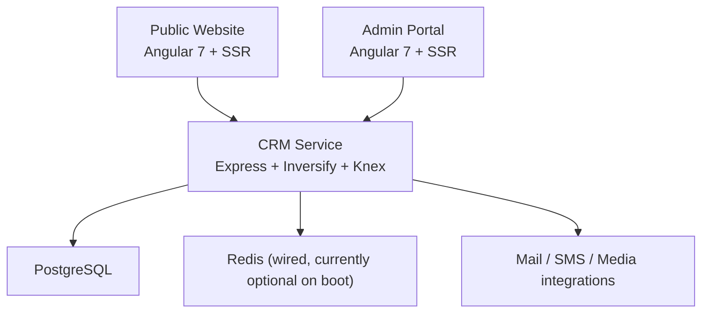
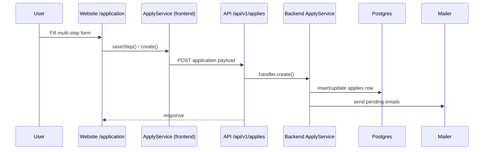

# System Overview

## 1. Muc dich he thong

Cum nay duoc tach thanh 3 phan ro rang:

- `website`: public onboarding/application website cho merchant, whitelabel, referral (`../../src/app/app-routing.module.ts:6-15`, `../../src/app/pages/application/application.routing.module.ts:7-20`).
- `portal`: admin portal cho login, dashboard, quan ly applies, users, account (`../../../qor-crm-portal-master/src/app/app-routing.module.ts:6-22`).
- `service`: backend REST API, auth, media upload, notifications, apply workflow, health, chat (`../../../qor-crm-service-master/src/routes/api/v1/index.ts:21-38`).

## 2. Topology

Bang chung:

- `website` SSR qua Express + `ngExpressEngine` (`../../server.ts:16-18`, `../../server.ts:47-75`).
- `portal` cung dung SSR pattern tuong tu (`../../../qor-crm-portal-master/server.ts:16-18`, `../../../qor-crm-portal-master/server.ts:47-75`).
- `service` boot qua IoC container va `Application.loadRoute(router).listen(...)` (`../../../qor-crm-service-master/src/server.ts:37-44`, `../../../qor-crm-service-master/src/ioc.ts:9-14`).
- DB connection dung Knex client `postgresql`, Bookshelf plugins `pagination` va `registry` (`../../../qor-crm-service-master/src/data/sql/connection.ts:75-84`).

## 3. Entry points

### Website

- Root route mount `PageComponent`, lazy-load `home`, `application`, `maintainer`, `error` (`../../src/app/app-routing.module.ts:6-20`).
- Application flow co 3 route chinh:
  - `/application`
  - `/application/:type`
  - `/application/confirmation`
  (`../../src/app/pages/application/application.routing.module.ts:7-20`)

### Portal

- Public pages: `/login`, `/forgot-password`
- Protected shell pages: `/`, `/applies`, `/users`, `/account`
  (`../../../qor-crm-portal-master/src/app/app-routing.module.ts:6-22`)

### Service

- Root router mount `/api/v1` (`../../../qor-crm-service-master/src/routes/index.ts:13`).
- Core namespaces:
  - `/application`
  - `/applies`
  - `/auth`
  - `/health`
  - `/me`
  - `/media`
  - `/notifications`
  - `/roles`
  - `/settings`
  - `/users`
  (`../../../qor-crm-service-master/src/routes/api/v1/index.ts:26-38`)

## 4. Frontend-to-backend wiring

Website `BaseService` doc `rest.apiUrl` va `rest.mediaUrl` tu config runtime, sau do them header `domain` va bearer token vao moi request (`../../src/app/services/base.service.ts:28-31`, `../../src/app/services/base.service.ts:57-74`).

Website config template tro thang vao:

- API: `https://api.tcamanagers.com/api/v1`
- Media: `https://api.tcamanagers.com/api/v1/media`
  (`../../src/app/configs/setting.template.ts:1-5`)

Portal `BaseService` dung cung co che nhung config goc la:

- API: `https://api.tcamanagers.com`
- Media: `https://api.tcamanagers.com`
  (`../../../qor-crm-portal-master/src/app/services/base.service.ts:26-29`, `../../../qor-crm-portal-master/src/app/configs/setting.template.ts:1-5`)

## 5. Luong du lieu business chinh

Bang chung trace:

- Website multi-step wizard save o `ProcessFormComponent.saveStep()` (`../../src/app/pages/application/components/process.component.ts:200-219`).
- Frontend submit qua `ApplyService.makeHttpPost(...)` (`../../src/app/services/apply.service.ts:10-17`).
- Backend public create endpoint la `POST /api/v1/applies` (`../../../qor-crm-service-master/src/routes/api/v1/apply/apply.router.ts:30-32`).
- Backend validate, gan `PENDING`, insert/update, roi gui email cho user va admin (`../../../qor-crm-service-master/src/interactors/apply.service.ts:42-87`).

## 6. State va tenancy theo domain

He thong co dau hieu multi-brand/multi-domain:

- Website chon language theo hostname, dac biet `DCR_MEXICO` (`../../src/app/app.component.ts:42-67`).
- Website va portal deu gui `HEADERS.DOMAIN = window.location.hostname` trong moi request (`../../src/app/services/base.service.ts:65-71`, `../../../qor-crm-portal-master/src/app/services/base.service.ts:55-69`).
- Backend `applies` schema co field `domain` (`../../../qor-crm-service-master/src/data/sql/schema.ts:195-220`).
- Report backend loc theo `domain` neu co (`../../../qor-crm-service-master/src/interactors/apply.service.ts:152-177`).

## 7. Operational behavior

- Backend se doi DB TCP available roi auto-run `migrate.latest()` tren startup (`../../../qor-crm-service-master/src/data/sql/connection.ts:86-123`).
- Backend middleware chain: i18n, language, `/docs`, json, urlencoded, helmet, compression, cors, access log, version check, maintenance, router, notFound, httpError, recover (`../../../qor-crm-service-master/src/app.ts:90-135`).
- Redis da duoc inject vao `Application` nhung init Redis dang bi comment trong boot path (`../../../qor-crm-service-master/src/app.ts:33-36`, `../../../qor-crm-service-master/src/app.ts:138-142`).

## 8. Design notes

- Stack frontend va backend deu la legacy generation: Angular 7 / TypeScript 3.1 va backend TS 2.9 (`../../package.json:16-94`, `../../../qor-crm-portal-master/package.json:16-96`, `../../../qor-crm-service-master/package.json:9-136`).
- Website public va portal admin chia se nhieu pattern service/model/helper, nhung tach thanh 2 repo frontend rieng.
