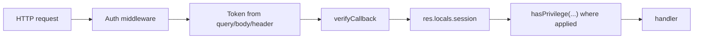

# API Surface

Base mount:

- Root mount: `/api/v1` (`../../../qor-crm-service-master/src/routes/index.ts:13`)
- Ping: `GET /api/v1/ping` (`../../../qor-crm-service-master/src/routes/api/v1/index.ts:21-24`)

## 1. Auth

File: `../../../qor-crm-service-master/src/routes/api/v1/auth/auth.router.ts:15-35`

- `POST /api/v1/auth/login`
- `POST /api/v1/auth/fb-login`
- `POST /api/v1/auth/register`
- `POST /api/v1/auth/register-verify`
- `POST /api/v1/auth/forgot-password`
- `POST /api/v1/auth/reset-password`
- `POST /api/v1/auth/admin/login`
- `POST /api/v1/auth/admin/forgot-password`
- `GET /api/v1/auth/admin/reset-password/:token`
- `POST /api/v1/auth/firebase` (authenticated)
- `POST /api/v1/auth/logout` (authenticated)

## 2. Current user

File: `../../../qor-crm-service-master/src/routes/api/v1/me/me.router.ts:15-23`

- `PUT /api/v1/me/password`
- `PUT /api/v1/me/devices`
- `GET /api/v1/me`
- `PUT /api/v1/me`

## 3. Applies

File: `../../../qor-crm-service-master/src/routes/api/v1/apply/apply.router.ts:16-32`

- `GET /api/v1/applies/report` (admin/manager)
- `GET /api/v1/applies/domain` (admin/manager)
- `GET /api/v1/applies/:id` (public)
- `PUT /api/v1/applies/:id` (admin/manager)
- `DELETE /api/v1/applies/:id` (admin/manager)
- `PUT /api/v1/applies/status/:id` (admin/manager)
- `GET /api/v1/applies` (admin/manager)
- `POST /api/v1/applies` (public)

Workflow lien quan:

- Create/update + pending email (`../../../qor-crm-service-master/src/interactors/apply.service.ts:42-87`)
- Change status + notify admin (`../../../qor-crm-service-master/src/interactors/apply.service.ts:119-149`)
- Report by date/domain (`../../../qor-crm-service-master/src/interactors/apply.service.ts:152-177`)

## 4. Application versions

File: `../../../qor-crm-service-master/src/routes/api/v1/application/application.router.ts:15-22`

- `GET /api/v1/application`
- `POST /api/v1/application`
- `GET /api/v1/application/:id`
- `PUT /api/v1/application/:id`
- `DELETE /api/v1/application/:id`

## 5. Users, roles, settings

Users: `../../../qor-crm-service-master/src/routes/api/v1/users/users.router.ts:15-22`

- `GET /api/v1/users/:id`
- `PUT /api/v1/users/:id`
- `DELETE /api/v1/users/:id`
- `GET /api/v1/users`
- `POST /api/v1/users`

Roles: `../../../qor-crm-service-master/src/routes/api/v1/roles/roles.router.ts:15-22`

- `GET /api/v1/roles/:id`
- `PUT /api/v1/roles/:id`
- `DELETE /api/v1/roles/:id`
- `GET /api/v1/roles`
- `POST /api/v1/roles`

Settings: `../../../qor-crm-service-master/src/routes/api/v1/settings/settings.router.ts:16-23`

- `GET /api/v1/settings/:id`
- `PUT /api/v1/settings/:id`
- `DELETE /api/v1/settings/:id`
- `GET /api/v1/settings`
- `POST /api/v1/settings`

## 6. Media, notifications, pin, chat, health

Media: `../../../qor-crm-service-master/src/routes/api/v1/media/media.router.ts:15-26`

- `GET /api/v1/media/callback`
- `POST /api/v1/media/callback`
- `POST /api/v1/media/files`
- `POST /api/v1/media/images`
- `GET /api/v1/media/:id`

Notifications: `../../../qor-crm-service-master/src/routes/api/v1/notifications/notification.router.ts:15-28`

- `PUT /api/v1/notifications/read/:id`
- `PUT /api/v1/notifications/read_all`
- `GET /api/v1/notifications/:id`
- `PUT /api/v1/notifications/:id`
- `DELETE /api/v1/notifications/:id`
- `GET /api/v1/notifications`
- `POST /api/v1/notifications`

Pin: `../../../qor-crm-service-master/src/routes/api/v1/pin/pin.router.ts:12-16`

- `POST /api/v1/pin/send`
- `POST /api/v1/pin/verify`

Chat: `../../../qor-crm-service-master/src/routes/api/v1/chat/chat.router.ts:14-15`

- `POST /api/v1/chat/conversations`

Health: `../../../qor-crm-service-master/src/routes/api/v1/health/health.router.ts:13-14`

- `GET /api/v1/health`

## 7. Auth and authorization model

Bang chung:

- Auth middleware chap nhan token tu query, body hoac `Authorization: Bearer ...` (`../../../qor-crm-service-master/src/middlewares/reusables/authentication.ts:32-89`).
- Neu verify thanh cong thi gan `res.locals.session` (`../../../qor-crm-service-master/src/middlewares/reusables/authentication.ts:90-98`).
- Nhieu route admin dung `hasPrivilege([ROLE.SYSTEM_ADMIN, ROLE.MANAGER])` o router level, vi du `applies`, `users`, `roles` (`../../../qor-crm-service-master/src/routes/api/v1/apply/apply.router.ts:16-32`, `../../../qor-crm-service-master/src/routes/api/v1/users/users.router.ts:15-22`, `../../../qor-crm-service-master/src/routes/api/v1/roles/roles.router.ts:15-22`).
